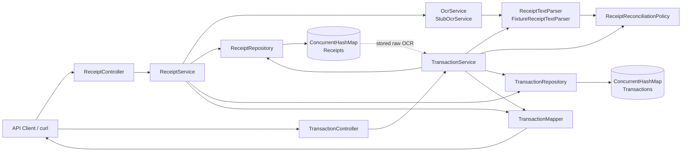

# Architecture Notes

## Core invariants

1. A receipt maps to at most one transaction identity.
2. The receipt grand total is authoritative.
3. Balancing/fake line items are never manufactured.
4. Taxes are first-class records rather than a single header field.
5. Raw OCR text is retained separately from derived business fields.
6. Re-itemization replaces line items only; transaction identity, header fields, and stored taxes remain unchanged.
7. Manual item changes are validated before atomic replacement.
8. Monetary arithmetic uses `BigDecimal`.
9. Stored domain objects expose immutable collections and defensive byte-array copies.
10. Repeated or concurrent processing of the same receipt reuses the same transaction ID.

## Responsibility boundaries

### Controllers

Controllers translate HTTP into application calls and return explicit API DTOs. They do not contain reconciliation, parsing, persistence, or concurrency logic.

### Application services

`ReceiptService` orchestrates upload and initial processing. `TransactionService` orchestrates retrieval, re-itemization, and manual item replacement.

### Extraction

`OcrService` converts receipt content into text. `ReceiptTextParser` converts OCR text into a `ReceiptExtraction`. The current `StubOcrService` and `FixtureReceiptTextParser` are intentionally deterministic because the exercise explicitly permits stub OCR and fixture-driven extraction.

### Domain policy

`ReceiptReconciliationPolicy` owns the core reconciliation rule. Keeping this rule independent from controllers and repositories makes it easy to unit test and change without coupling it to transport or persistence.

### Persistence

`ReceiptRepository` and `TransactionRepository` hide storage mechanics. Their current implementations use `ConcurrentHashMap`; a durable implementation can replace them without changing the application services' public behavior.

### API mapping

`TransactionMapper` keeps domain records separate from external JSON contracts. That prevents persistence/domain refactors from accidentally becoming API-breaking changes.

## In-memory concurrency model

Two `ConcurrentHashMap`s provide average O(1) lookup/update by UUID.

- Receipt processing uses `compute` to atomically reserve/reuse the one transaction ID belonging to a receipt.
- Transaction PATCH and re-itemization use `compute`, so validation plus replacement is atomic for one transaction key.
- There is no global `synchronized` block and no explicit lock registry.
- Potentially expensive OCR/parsing work is deliberately kept outside `compute`.

### Cross-map consistency

The in-memory implementation cannot provide a true atomic transaction across two maps. To keep the assignment simple while preserving retry safety, receipt state first reserves the transaction ID and the transaction snapshot is then written under that ID. If execution stops between those steps, reprocessing reuses the reserved ID and repairs the missing transaction snapshot.

In production, this invariant should be enforced with a uniqueness constraint on `receipt_id` and a database transaction, not with application-level distributed locks.

## Why these patterns and not more?

Patterns are used only at boundaries likely to vary or where they isolate an important rule:

- Repository: persistence boundary
- Strategy/port: OCR and parsing boundary
- Domain policy: reconciliation invariant
- Mapper: API/domain boundary
- Constructor injection: explicit dependencies and testability

Generic base repositories, abstract CRUD services, factories for simple records, builders, CQRS, event sourcing, and message brokers would add ceremony without solving a requirement in this task.

## Production evolution

A production version could evolve as follows without changing the core business invariants:

- uploaded bytes -> object storage
- in-memory repositories -> durable relational/document persistence
- database uniqueness on receipt-to-transaction relationship
- database transaction for receipt/transaction mutations
- OCR -> external provider through `OcrService`
- asynchronous extraction only when latency/throughput justifies a queue
- idempotency key + retry policy for distributed processing
- metrics/tracing around OCR latency, parsing failures, reconciliation mismatches, and retry counts

CAP is not meaningfully exercised by this single-process solution. It becomes relevant only once state is distributed or replicated. For financial mutation paths, consistency would generally be prioritized; OCR/extraction is derived and retryable, so temporary unavailability is preferable to silently inconsistent financial state.

## Architecture diagram

### Request flows

**Initial processing**

`POST /receipts` -> store uploaded bytes -> `POST /receipts/{id}/process` -> stub OCR -> parse -> reconcile -> atomically establish/reuse transaction identity -> persist transaction snapshot.

**Re-itemization**

`POST /transactions/{id}/itemize` -> load transaction -> load receipt -> reuse stored raw OCR -> parse line items -> reconcile against existing total/taxes -> atomically replace line items/status only.

**Manual item override**

`PATCH /transactions/{id}/items` -> validate request -> reconcile proposed items against stored total/taxes -> atomically replace on success, otherwise return `409` and keep prior state.
